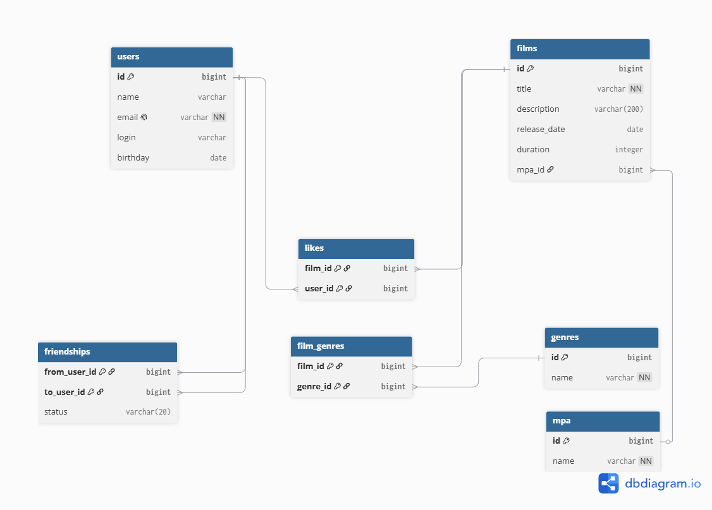

# java-filmorate
Template repository for Filmorate project.

## Над проектом работали:
Шмигельский Назар — тимлид, удаление фильмов и пользователей, рекомендации, лента событий.  
Сейфулаев Заур — отзывы, поиск.  
Шабельская Кристина — общие фильмы, режиссеры, вывод популярных фильмов по жанру и годам.


## Схема базы данных



### Примеры запросов

**Получение всех фильмов:**
\```sql
SELECT * FROM films;
\```

**Получение всех пользователей:**
\```sql
SELECT * FROM users;
\```

**Топ N наиболее популярных фильмов:**
\```sql
SELECT f.*, COUNT(l.user_id) AS likes_count
FROM films f
LEFT JOIN likes l ON f.id = l.film_id
GROUP BY f.id
ORDER BY likes_count DESC
LIMIT ?;
\```

**Список общих друзей с другим пользователем:**
\```sql
SELECT u.*
FROM users u
JOIN friendships f1 ON u.id = f1.to_user_id
    AND f1.from_user_id = ? AND f1.status = 'CONFIRMED'
JOIN friendships f2 ON u.id = f2.to_user_id
    AND f2.from_user_id = ? AND f2.status = 'CONFIRMED';
\```

**Получение фильма с жанрами и рейтингом:**
\```sql
SELECT f.*, m.name AS mpa_name, g.name AS genre_name
FROM films f
LEFT JOIN mpa m ON f.mpa_id = m.id
LEFT JOIN film_genres fg ON f.id = fg.film_id   
LEFT JOIN genres g ON fg.genre_id = g.id
WHERE f.id = ?;
\```

**Подтверждённые друзья пользователя:**
\```sql
SELECT u.*
FROM users u
JOIN friendships f ON u.id = f.to_user_id
WHERE f.from_user_id = ? AND f.status = 'CONFIRMED';
\```